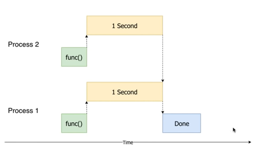

# 실행결과

Process id :  19516 -- 28  
Process id :  19516 -- 29  
Process id :  21352 -- 0  
Process id :  19516 -- 30  
Process id :  21352 -- 1  
Process id :  19516 -- 31  
Process id :  21352 -- 2  
Process id :  19516 -- 32  
Process id :  21352 -- 3  
Process id :  19516 -- 33  
Process id :  21352 -- 4  
Process id :  19516 -- 34  
Process id :  21352 -- 5  
Process id :  19516 -- 35  
Process id :  21352 -- 6  

Process id :  21352 -- 187  
Process id :  21352 -- 188  
Process id :  21352 -- 189  
Process id :  21352 -- 190  
Process id :  21352 -- 191  
Process id :  21352 -- 192  
Process id :  21352 -- 193  
Process id :  21352 -- 194  
Process id :  21352 -- 195  
Process id :  21352 -- 196  
Process id :  21352 -- 197  
Process id :  21352 -- 198  
Process id :  21352 -- 199  
