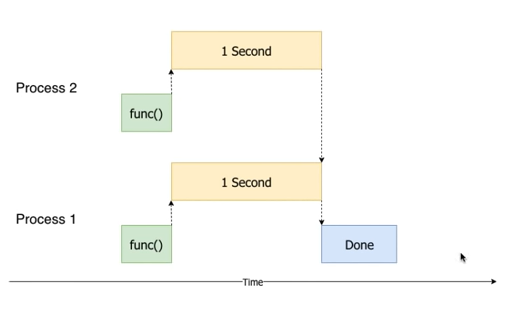

# 실행결과 example_1.py
sleeping 1 second
sleeping 1 second
Process id :  1712
done sleeping
Process id :  6564
done sleeping
1.1sec

# 실행결과 example_2.py
2개의 processing id 가 있다.

Process id :  19516 -- 28  
Process id :  19516 -- 29  
Process id :  21352 -- 0  
Process id :  19516 -- 30  
Process id :  21352 -- 1  
Process id :  19516 -- 31  
Process id :  21352 -- 2  
Process id :  19516 -- 32  

Process id :  21352 -- 195  
Process id :  21352 -- 196  
Process id :  21352 -- 197  
Process id :  21352 -- 198  
Process id :  21352 -- 199  
